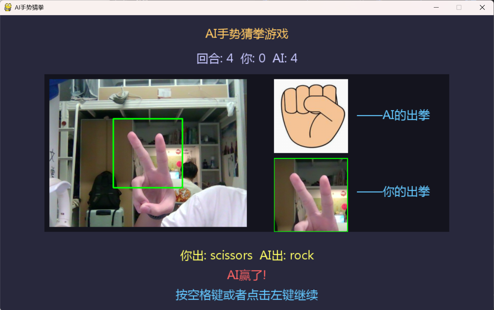

# Rock-Scissors-Paper —— AI手势猜拳游戏

## 项目简介

基于深度学习的石头剪刀布人机对战游戏。通过摄像头实时识别玩家手势（石头、剪刀、布），AI 根据识别结果做出应对，采用克制策略保证必胜。

## 运行效果



## 功能特点

- **实时手势识别**：通过摄像头捕捉玩家手势，Keras 模型实时推理
- **AI 克制策略**：识别到玩家手势后，AI 永远出能赢的手势
- **音效反馈**：开始、胜利、失败均有音效提示
- **倒计时机制**：3秒倒计时，增加游戏紧张感
- **分数统计**：实时显示回合数和双方得分

## 操作说明

| 操作 | 说明 |
|------|------|
| 按 **空格键** 或 **鼠标左键** | 开始新回合 |
| 对摄像头做出手势 | 石头 ✊ / 剪刀 ✌️ / 布 ✋ |
| 等待倒计时结束 | AI 自动识别并出拳 |

## 安装环境

### 环境要求

- Python >= 3.8
- 摄像头（USB 或内置）

### 安装步骤

**1. 安装 uv（推荐）**

```powershell
irm https://astral.sh/uv/install.ps1 | iex
```

**2. 创建虚拟环境**

```powershell
cd F:\Project\Rock-Scissors-Paper
uv python install 3.8
uv venv --python 3.8
.\venv\Scripts\activate
```

**3. 安装依赖**

```powershell
uv pip install numpy==1.21.6 opencv-python==4.5.5.64 pillow==9.5.0 pygame==1.9.6 tensorflow==2.11.0
```

**4. 运行游戏**

```powershell
python pygame_rockscissorpaper.py
```

或直接双击 `start.vbs`（无命令行窗口）。

## 打包为 exe

```powershell
uv pip install pyinstaller

pyinstaller --onefile --windowed --add-data data/fonts;data/fonts --add-data data/images;data/images --add-data data/sounds;data/sounds --add-data data/models;data/models --add-data data/labels;data/labels pygame_rockscissorpaper.py
```

打包完成后，exe 位于 `dist/pygame_rockscissorpaper.exe`，无需安装 Python 即可运行。

## 依赖列表

| 包名 | 版本 | 用途 |
|------|------|------|
| numpy | 1.21.6 | 数组操作 |
| opencv-python | 4.5.5.64 | 摄像头采集与图像处理 |
| pillow | 9.5.0 | 图像处理 |
| pygame | 1.9.6 | 游戏界面与音效 |
| tensorflow | 2.11.0 | 深度学习模型推理 |

## 项目结构

```
Rock-Scissors-Paper/
├── pygame_rockscissorpaper.py   # 主程序
├── start.bat                    # 启动脚本（有命令行）
├── start.vbs                    # 启动脚本（无命令行）
├── data/
│   ├── fonts/                   # 字体
│   │   └── msyh.TTF
│   ├── images/                  # AI手势图片
│   │   ├── ai_original.png
│   │   ├── ai_paper.png
│   │   ├── ai_rock.png
│   │   └── ai_scissors.png
│   ├── labels/                  # 标签文件
│   │   └── labels.txt
│   ├── models/                  # 训练模型
│   │   └── keras_model_good.h5
│   ├── sounds/                  # 音效文件
│   │   ├── defeat.wav
│   │   ├── open_sound.wav
│   │   └── victory.wav
│   └── samples/                 # 训练样本（不打包）
│       ├── paper-samples.zip
│       ├── rock-samples.zip
│       └── scissors-samples.zip
├── dist/                        # 打包输出
│   └── pygame_rockscissorpaper.exe
├── .gitignore
├── readme图片.png
└── README.md
```

## 技术栈

- **Python 3.8** — 运行环境
- **TensorFlow/Keras** — 深度学习模型推理
- **OpenCV** — 摄像头采集与图像预处理
- **Pygame** — 游戏界面渲染与音效播放

## 作者

主要作者：@zz
